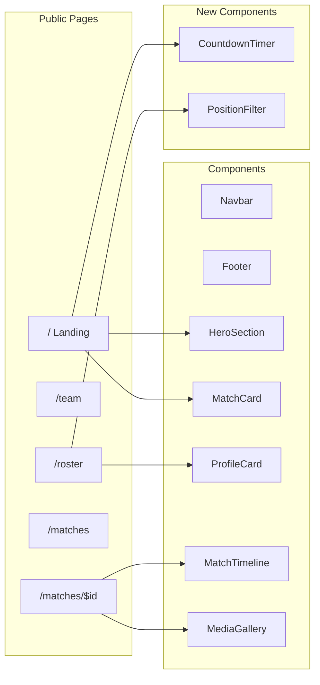

# Responsive UI Redesign Based on Stitch Outputs

## Current State

The project is a **React 19 + Vite SPA** using TanStack Router, TanStack Query, Tailwind v4, and shadcn/ui. The public pages have basic functional styling (black/orange/white tokens, Jost + Inter fonts) but lack the visual richness shown in the Stitch designs. The admin pages use a standard shadcn sidebar layout.

The Stitch outputs define a **"Swoosh Bold"** design system: high-contrast black/white with blaze orange (`#FA5400`) accents, Jost 900 display type, tight grids, bento layouts, full-bleed hero imagery, and pill-shaped CTAs.

## Design Token Foundation

No changes needed to [frontend/src/index.css](frontend/src/index.css) `:root` variables -- the existing tokens (`--primary: #111111`, `--secondary: #fa5400`, `--muted: #f5f5f5`, `--border: #e5e5e5`) already align with the Stitch DESIGN.md. One addition: a `--color-secondary` mapping in the `@theme inline` block if not already present.

## Scope

Redesign targets **6 public routes** and **6 shared components**, plus 2-3 new components:

---

## 1. Public Layout and Navbar

**File:** [frontend/src/routes/_public.tsx](frontend/src/routes/_public.tsx), [frontend/src/components/Public/Navbar.tsx](frontend/src/components/Public/Navbar.tsx)

### Navbar (Stitch Reference: white/blur, 64px, 2px black border-bottom)

**Desktop (>=768px):**
- `h-16`, `bg-white/95 backdrop-blur-md`, `border-b-2 border-black`
- Left: team name in Jost 900 italic (black, not white like current)
- Center: nav links (首页, 球队介绍, 阵容, 赛事管理) with active **underline decoration**
- Right: account icon button + search icon
- Sticky `top-0 z-50`

**Mobile (<768px):**
- Same 64px height, hamburger icon on right
- Full-screen overlay menu with stacked links, large touch targets (48px min)
- Smooth slide-down animation (200ms ease-out)

### Footer (Stitch Reference: full-width black bar, border-t-4, white links)

**New component** replacing the current inline footer:
- `bg-black text-white`, `border-t-4 border-[#FA5400]`
- Team name in Jost 700, centered
- Footer links row (隐私政策, 联系我们, 加入我们)
- Copyright line in Inter 14px
- Mobile: stacked vertically, generous padding

---

## 2. Landing Page

**Files:** [frontend/src/routes/_public/index.tsx](frontend/src/routes/_public/index.tsx), [frontend/src/components/Public/HeroSection.tsx](frontend/src/components/Public/HeroSection.tsx)

### Hero Section (Stitch: full-bleed, ~819px, B/W image, gradient overlay)

**Desktop:**
- `min-h-[80vh]` full-width, background placeholder image (CSS gradient for now since no real images), `bg-black/40` overlay
- Animated orange pill badge "赛季进行中" with pulsing green dot
- **Display-hero** headline (Jost 900, `text-7xl lg:text-[96px]`, leading-[0.95]) with orange `` accent
- Subtitle paragraph in Inter 400
- Two CTAs: primary pill (`bg-primary text-white rounded-[30px] h-12`) + outline secondary pill

**Mobile:**
- `min-h-[70vh]`, smaller type scale (`text-4xl`)
- CTAs stack vertically, full-width
- Badge above headline

### Next Match Section (Stitch: bento 2+1 columns)

**Desktop:**
- Section title "下一场比赛 | NEXT MATCH" with date right-aligned
- 2-column bento: left card (match info with VS team circles), right card (countdown timer, dark bg)
- New `CountdownTimer` component with large tabular numerals (Jost 900)

**Mobile:**
- Stack cards vertically
- Countdown timer full-width

### Highlights Section (Stitch: asymmetric bento grid)

- Section header with `border-b-2` and "全部战报 >" link
- Asymmetric bento grid: large featured image (2 rows), smaller cards, orange promo card
- Mobile: single-column stack with 16px gap
- Uses `MatchCard` for recent matches but styled differently (image-based cards vs current text-only)

---

## 3. Team Introduction Page

**File:** [frontend/src/routes/_public/team.tsx](frontend/src/routes/_public/team.tsx)

The team content is **admin-editable rich text** (TipTap HTML), so this page stays dynamic. Changes:

- **Page header**: styled hero banner with team name, black background, Jost display heading
- **Content wrapper**: better prose styling with `prose-headings:font-display`, proper image handling
- **Responsive**: max-w-4xl content area on desktop, full-width on mobile with `px-4`
- Style the `prose` class to match Swoosh Bold typography (Jost headings, Inter body)

---

## 4. Roster / Coaches & Players

**Files:** [frontend/src/routes/_public/roster.tsx](frontend/src/routes/_public/roster.tsx), [frontend/src/components/Public/ProfileCard.tsx](frontend/src/components/Public/ProfileCard.tsx)

### Page Structure (Stitch: section headers with border-b-4)

- Page title "阵容" (Jost display) with subtitle
- "COACHING STAFF" section with `border-b-4 border-black` header
- "PLAYERS" section with position filter

### ProfileCard Redesign

**Coach cards:**
- Square photo aspect ratio, `grayscale hover:grayscale-0` filter transition
- Label-caps role (e.g., "HEAD COACH") in Inter 600 12px uppercase
- Name in Jost 700
- Hover: `translateY(-4px)` + shadow

**Player cards:**
- Jersey number badge: `absolute top-2 left-2` black circle, Jost 900, white text
- Photo with `grayscale` filter, hover removes grayscale + subtle scale
- Position label in uppercase caps, name in Jost 700

### New PositionFilter Component

- Horizontal row of text buttons: All / Forwards / Midfielders / Defenders / Goalkeepers
- Active: underline or bold weight
- Mobile: horizontally scrollable with `overflow-x-auto`, snap scroll

### Grid Responsive

- Desktop: `grid-cols-5 gap-[4px]` (tight grid per Stitch)
- Tablet: `grid-cols-3 gap-3`
- Mobile: `grid-cols-2 gap-3`

---

## 5. Matches List

**File:** [frontend/src/routes/_public/matches.index.tsx](frontend/src/routes/_public/matches.index.tsx), [frontend/src/components/Public/MatchCard.tsx](frontend/src/components/Public/MatchCard.tsx)

### Tab Filters

- Already pill-shaped -- keep current pattern, align styling with `rounded-[30px]` and Jost 700

### MatchCard Redesign

- Border card with hover lift (already present, refine)
- Add team circle/initial badges (观/外 style from Stitch) for visual flair
- Larger score display for completed matches
- Live matches: pulsing orange dot indicator
- Mobile: full-width cards, adequate padding

---

## 6. Match Detail

**File:** [frontend/src/routes/_public/matches.$matchId.tsx](frontend/src/routes/_public/matches.$matchId.tsx)

- **Header card**: larger, more dramatic score display. Jost 900 for team names, `text-5xl` score
- **Live indicator**: pulsing red badge with "LIVE" text
- **Timeline**: current implementation is good; add subtle animation for new entries
- **Media gallery**: tighter grid, grayscale-to-color on photo hover

---

## 7. Responsive Strategy

All pages follow **mobile-first** with three breakpoints:
- **Mobile** (default): `<768px` -- single column, full-width, stacked layouts
- **Tablet** (`md:`): `768px+` -- 2-3 column grids
- **Desktop** (`lg:`): `1024px+` -- full bento layouts, 5-column roster grids

Key mobile patterns:
- Min touch target: 44x44px on all interactive elements
- No horizontal scroll
- `min-h-dvh` instead of `100vh`
- Hamburger nav with full-screen overlay
- CTAs full-width on mobile
- Content padding: `px-4` mobile, `px-8` desktop

---

## Files Changed Summary

| File | Change Type |
|------|------------|
| `frontend/src/routes/_public.tsx` | Edit: new footer, layout adjustments |
| `frontend/src/components/Public/Navbar.tsx` | **Major rewrite**: white/blur navbar, mobile overlay |
| `frontend/src/components/Public/HeroSection.tsx` | **Major rewrite**: full-bleed hero with CTAs |
| `frontend/src/components/Public/MatchCard.tsx` | Edit: visual refinements, team badges |
| `frontend/src/components/Public/ProfileCard.tsx` | **Major rewrite**: grayscale photos, jersey badges |
| `frontend/src/components/Public/MatchTimeline.tsx` | Minor refinements |
| `frontend/src/components/Public/MediaGallery.tsx` | Edit: tighter grid, hover effects |
| `frontend/src/routes/_public/index.tsx` | **Major rewrite**: bento landing page |
| `frontend/src/routes/_public/team.tsx` | Edit: hero header, prose styling |
| `frontend/src/routes/_public/roster.tsx` | **Major rewrite**: position filter, section headers |
| `frontend/src/routes/_public/matches.index.tsx` | Minor styling refinements |
| `frontend/src/routes/_public/matches.$matchId.tsx` | Edit: dramatic score display |
| `frontend/src/components/Public/CountdownTimer.tsx` | **New**: countdown to next match |
| `frontend/src/components/Public/PositionFilter.tsx` | **New**: position filter for roster |
| `frontend/src/components/Public/Footer.tsx` | **New**: black footer component |
| `frontend/src/index.css` | Minor: ensure all theme tokens are mapped |
